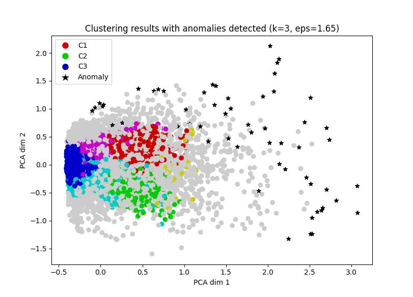
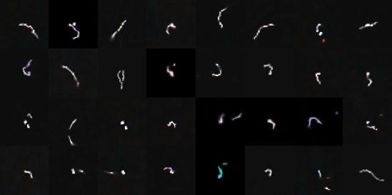

### Source codes for paper:

# Detection of potentially anomalous cosmic particles tracks acquired with complementary metal-oxide-semiconductor sensors: validation of rough k-means clustering approach with Principal Components Analysis features extraction

Abstract: TO BE ADDED

Keywords: Cosmic-ray particle, Rough sets, Rough k-means, Anomalies detection, Principal Components Analysis, Complementary metal-oxide-semiconductor sensors

## Requirements

- Python 3.X
- numpy >= 1.22
- opencv-python >= 4.5

## Example resutls

Clustering results of the proposed algorithm for rough k-means with parameters $(k=3,t=1.65,w_{lower}=0.9,w_{upper}=0.1)$. 

Visualization of the results of the proposed algorithm for rough k-means with paramters $(k=3,t=1.65,w_{lower}=0.9,w_{upper}=0.1)$.

## Full text

TBA

## Cite as

TBA

## Source code references

We have used parts of source codes from:
- [Rough k-means clustering](https://github.com/geofizx/rough-clustering)
